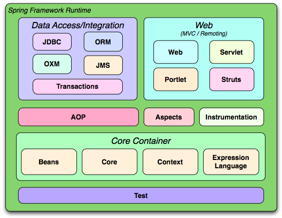
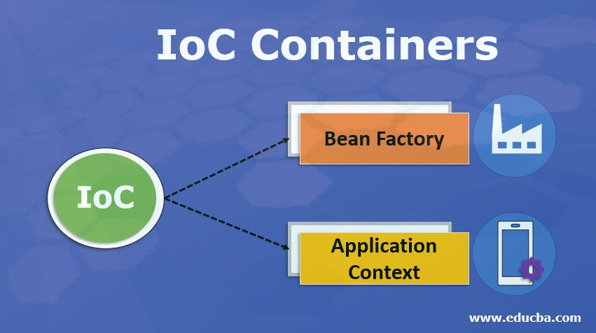
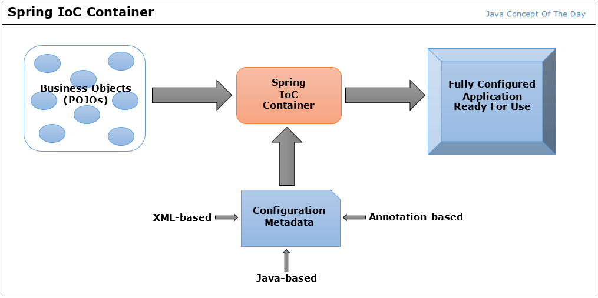

****
### What is Spring Framework?

- **Spring is a dependency injection framework is to make loosely coupled application.**
- **Spring Framework makes the easy development of JavaEE Application.**
- **It was developed by Rod Johnson in 2003.**
***

### What is IoC Container?

- **The IoC Container is responsible to instantiate,configure and assemble the objects.**
- **The IoC container gets informations from the xml file and works accordingly.**
- **The main tasks performed by IoC Container are:**
  * to instantiate the application class
  * to configure the object
  * to assemble the dependencies between the objects
        
- **There are two type of container. They are :**
        
        BeanFactory
        ApplicationContext
***
